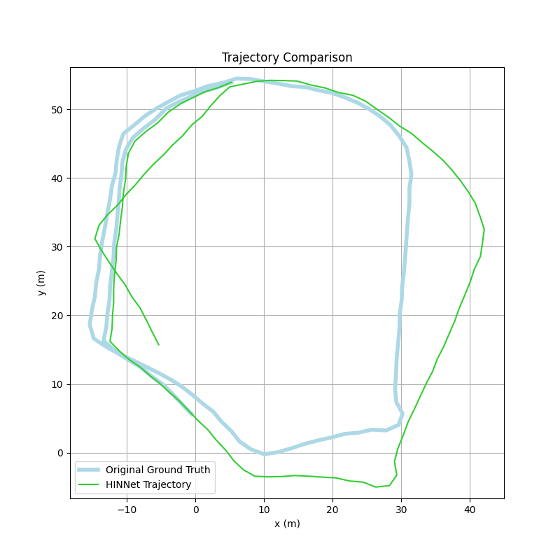
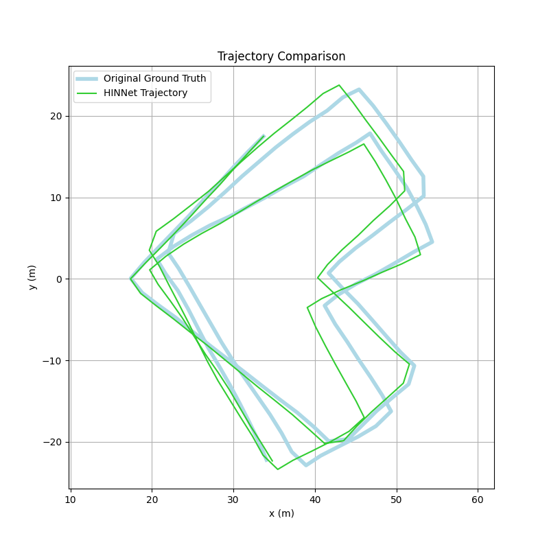
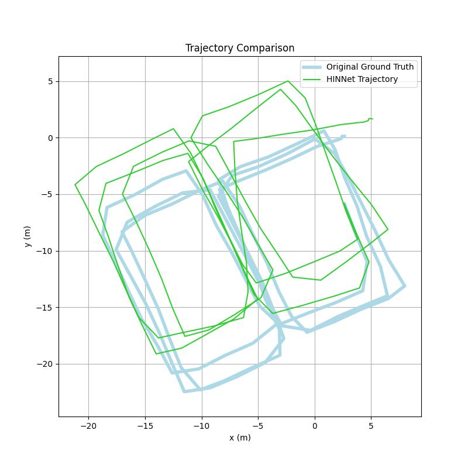

# HINNet: Inertial navigation with head-mounted sensors using a neural network

This repository is associated with the paper "HINNet: Inertial navigation with head-mounted sensors using a neural network," published in *Engineering Applications of Artificial Intelligence*.

## Introduction

Human inertial navigation systems are rapidly developing and have shown great potential in healthcare, smart homes, sports, and emergency services. Placing inertial measurement units (IMUs) on the head for localization is a relatively new approach but offers an interesting option as many everyday head-worn items could be equipped with sensors. However, there is a lack of research in this area, and no current solutions allow for free head rotations during long periods of walking.

To address this, we present HINNet, the first deep neural network (DNN) pedestrian inertial navigation system that allows for free head movements with head-mounted IMUs. HINNet deploys a 2-layer bi-directional Long Short-Term Memory (LSTM) network. A novel 'peak ratio' feature is introduced and used as part of the input to the neural network to differentiate between head movements and changes in walking patterns.

[cite_start]A dataset was collected from 8 subjects, totaling 528 minutes of data on three different tracks for training and verification.

## Dataset Link

The original dataset can be found on GitHub: [HINNet_Dataset](https://github.com/Oxford-NIL/ROCIP)

### Trajectories
Trajectories of HINNet Method: 

